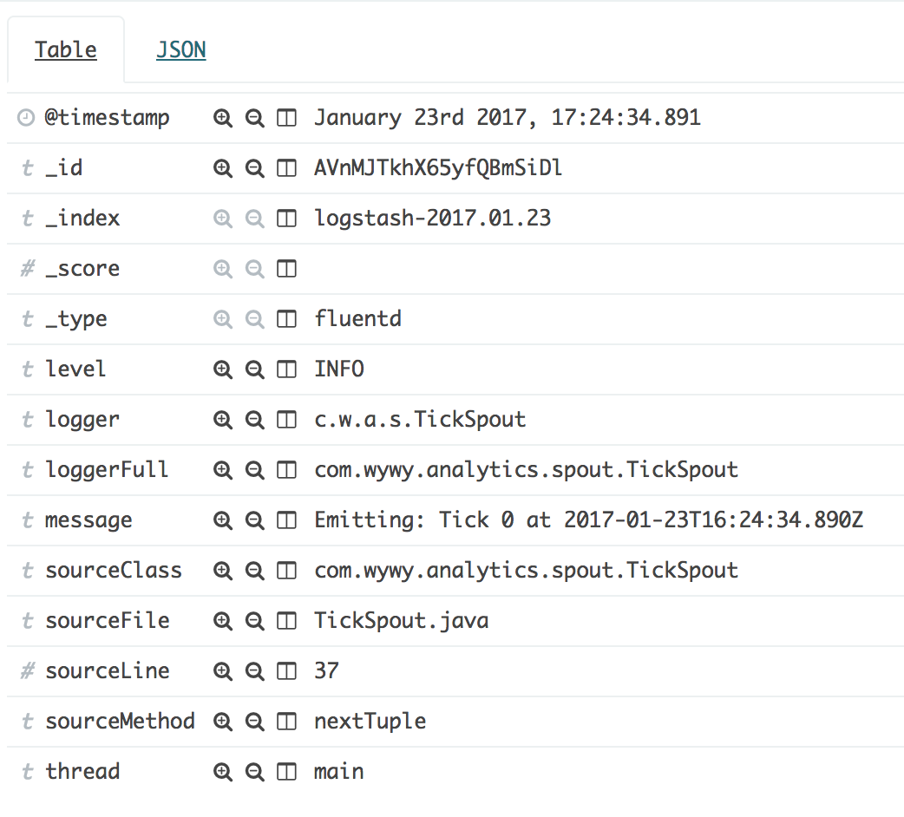

# wywygmbh/log4j-plugin-fluency log4j to fluentd log appender
[](https://badge.fury.io/gh/wywygmbh%2Flog4j-plugin-fluency)
[](https://travis-ci.org/wywygmbh/log4j-plugin-fluency)

Simple logging from java to [fluentd](http://www.fluentd.org/) using Log4j 2

## Features

This is a thin wrapper taking Log4j log events, adding some metadata and passing them to fluency

* easy to integrate Log4j 2 appender (no code changes required!)
* fluentd forward protocol
* all the benefits from [fluency](https://github.com/komamitsu/fluency)



## Install

Place the `.jar` in your classpath

TODO: add maven and gradle
 
## Usage

```xml
<?xml version="1.0" encoding="UTF-8"?>
<Configuration packages="com.wywy.log4j.appender">
    <Appenders>
        <Fluency name="fluency" tag="yourTag" application="yourApplication" />
    </Appenders>
    <Loggers>
        <root level="info"> <!-- We log everything -->
            <appender-ref ref="fluency"/>
        </root>
    </Loggers>
</Configuration>
```

`packages` is required for log4j to find the Appender ([see](https://logging.apache.org/log4j/2.x/manual/configuration.html#ConfigurationSyntax))

### Configuration

`tag`

  **required** - tag to identify messages, can be used in fluentd for message manipulation
    
`application`

  optional - additional message field to append. useful if you have a bunch of applications and want to tell messages apart

## Internals

The appender gets initialized by log4j and creates a new `Fluency.defaultFluency();`.

All log messages get aggregated with some additional fields and handed over to fluency.
 
fluency will forward the messages to a fluentd running on localhost.

## License

Copyright 2017 wywy GmbH

Licensed under the Apache License, Version 2.0 (the "License");
you may not use this file except in compliance with the License.
You may obtain a copy of the License at

    http://www.apache.org/licenses/LICENSE-2.0

Unless required by applicable law or agreed to in writing, software
distributed under the License is distributed on an "AS IS" BASIS,
WITHOUT WARRANTIES OR CONDITIONS OF ANY KIND, either express or implied.
See the License for the specific language governing permissions and
limitations under the License.

This code is being actively maintained by some fellow engineers at [wywy GmbH](http://wywy.com/).